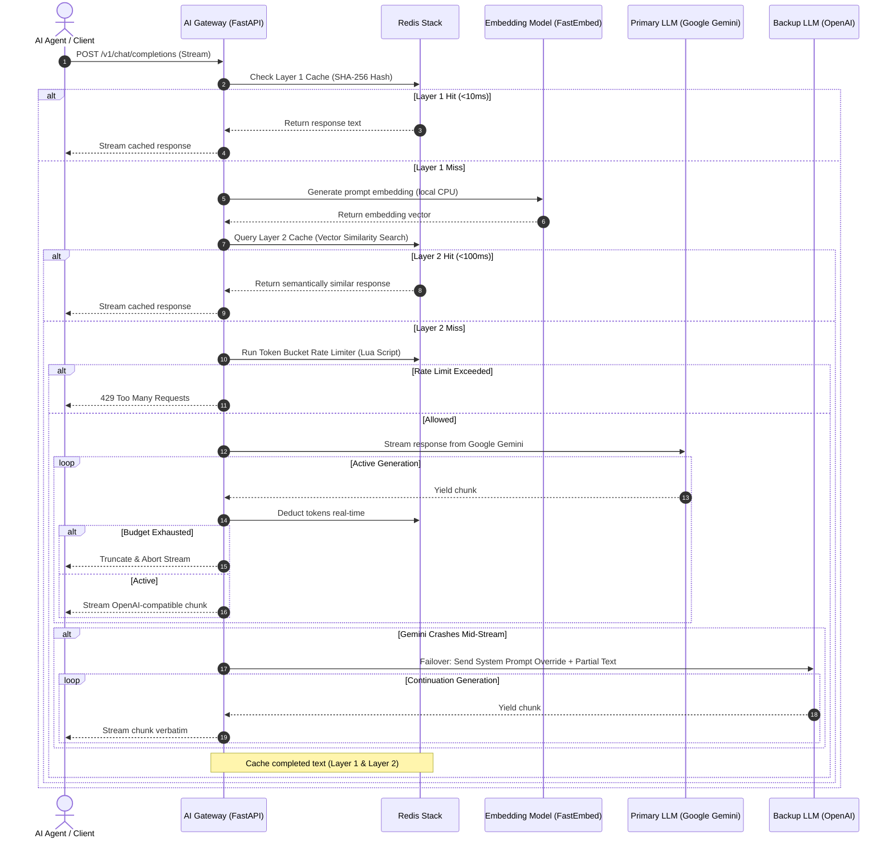

# High-Performance Resilient AI Gateway & Proxy

An asynchronous, high-performance intelligent AI Gateway that sits between enterprise applications (or AI Agents) and Large Language Model (LLM) providers (Google Gemini, OpenAI). 

This gateway is architected to address the three most critical challenges of deploying GenAI in production at scale: **Cost**, **Reliability (High Availability)**, and **Observability**.

---

## Key Features

### 1. Cost Optimization: Dual-Layer Caching
* **Layer 1 (Exact Match)**: Computes a SHA-256 hash of the chat messages, model, and temperature. Queries Redis conventional String/Hash store for instant retrieval (`<5ms` latency).
* **Layer 2 (Semantic Cache)**: Leverages **Redis Stack Vector Search** (HNSW index) and **FastEmbed** (`sentence-transformers/all-MiniLM-L6-v2` run locally on CPU) to check semantic similarity. If a user's prompt is semantically equivalent to a cached query above the similarity threshold (default: `0.90`), the response is returned instantly (`<100ms` latency) with zero upstream LLM costs.
* **Graceful Degradation**: If the Redis instance lacks the RediSearch module (e.g., in minimal testing environments), the gateway automatically degrades to Layer 1 exact caching without interrupting the service.

### 2. Congestion & Budget Control: Token Bucket Rate Limiter
* **Real-time Token Counting**: Uses `tiktoken` (for OpenAI and Google Gemini) and Hugging Face `tokenizers` (for optional Anthropic models) executed asynchronously on a background worker thread pool to avoid blocking the event loop.
* **Atomic Token Bucket (Redis Lua Script)**: Deducts input tokens pre-flight and output tokens post-stream. It automatically tracks token capacity and refill rates per user key.
* **Infinite Loop Mitigation**: Real-time token consumption is tracked *during* streaming. If a client's budget is depleted or an agent gets trapped in an infinite generation loop, the gateway proactively terminates the SSE stream to prevent runaway costs.

### 3. Reliability: Mid-Stream Failover Router
* **Transparent Switching**: If the primary provider (Google Gemini) fails or disconnects *mid-stream* during generation, the gateway intercepts the error, extracts the `partial_text` generated so far, and seamlessly routes the remainder to the backup provider (OpenAI).
* **System Prompt Override Pattern**: Automatically converts the state into a continuation payload for OpenAI:
  ```json
  [
    {
      "role": "system",
      "content": "You are a continuation assistant... continue the response exactly from [PARTIAL_TEXT] without repeating it."
    }
  ]
  ```
* **Seamless Stitching**: The client's HTTP streaming connection remains open; subsequent token chunks generated by OpenAI are appended directly, producing a single, seamless response.

### 4. GenAI Observability & Monitoring
* **Distributed Tracing (OpenTelemetry)**: Instruments LLM and caching steps according to GenAI Semantic Conventions and exports traces to **Arize Phoenix** (OTLP/gRPC on port `4317`).
* **High-Frequency Metrics (Prometheus)**: Exposes a `/metrics` endpoint tracking request counts, TTFT (Time-to-First-Token) histograms, roundtrip latencies, token consumption, and estimated USD costs.
* **Grafana Visualizations**: Ready to connect with Prometheus for real-time monitoring dashboard analytics.

---

## System Architecture Flow



---

## Technical Stack

* **Backend Framework**: [FastAPI](https://fastapi.tiangolo.com/) (Asynchronous python web framework)
* **ASGI Server**: [Uvicorn](https://www.uvicorn.org/) (High-performance ASGI server)
* **Package Manager**: [uv](https://github.com/astral-sh/uv) (Astral's lightning-fast Python package compiler)
* **Cache Database**: [Redis Stack](https://redis.io/docs/about/about-stack/) (Redis with Vector Search search modules)
* **Vector Indexing**: [RedisVL](https://redisvl.com/) (Redis Vector Library client)
* **Local Embeddings**: [FastEmbed](https://qdrant.github.io/fastembed/) (Fast, lightweight CPU-optimized embedding library)
* **Observability SDKs**: 
  * [OpenTelemetry Python SDK](https://opentelemetry.io/docs/languages/python/) (For OTel tracing)
  * [Prometheus Client](https://github.com/prometheus/client_python) (For metrics exports)
  * [Arize Phoenix OTel](https://phoenix.arize.com/) (For trace collections)

---

## Project Structure

```
├── app/
│   ├── core/
│   │   ├── config.py           # Configuration environment setup (Pydantic v2)
│   │   ├── redis_client.py     # Asynchronous Redis manager & Lua script loader
│   │   └── observability.py    # OpenTelemetry Tracing & Prometheus metrics registration
│   ├── services/
│   │   ├── cache_service.py    # Dual-layer caching interface (Exact & Semantic)
│   │   ├── token_counter.py    # Asynchronous token counters (tiktoken & tokenizers)
│   │   └── failover_router.py  # Mid-stream failover SSE orchestrator & router
│   │   static/
│   │   └── index.html          # Interactive dark-themed admin test dashboard
│   └── main.py                 # Application root & API endpoints mapping
├── docker/
│   ├── docker-compose.yml      # Local stack infrastructure setup
│   └── prometheus.yml          # Prometheus scraper configuration
├── docs/
│   └── research/               # Lua scripts & semantic search prototypes
├── tests/
│   ├── test_gateway.py         # Standard components unit tests
│   └── test_failover.py        # Stream failover and OTel integrations tests
├── Dockerfile                  # Highly-optimized container build with uv
├── pyproject.toml              # Modern Python dependency definition
└── uv.lock                     # Dependencies lockfile
```

---

## Getting Started

### Prerequisites
* Python 3.11+
* Docker & Docker Compose
* Upstream API Keys (OpenAI API key and Google Gemini API key)

### Running Locally (Development Mode)

1. **Clone the repository**:
   ```bash
   git clone git@github.com:levietdc/llm_gateway.git
   cd llm_gateway
   ```

2. **Configure environment variables**:
   Copy `.env.example` to `.env` and fill in your keys:
   ```bash
   cp .env.example .env
   ```

3. **Install dependencies and create virtual environment using `uv`**:
   Ensure `uv` is installed (`curl -LsSf https://astral.sh/uv/install.sh | sh`):
   ```bash
   uv venv
   source .venv/bin/activate
   uv sync
   ```

4. **Start local Redis Stack** (requires Docker):
   ```bash
   docker run -d --name redis-stack -p 6379:6379 -p 8001:8001 redis/redis-stack:latest
   ```

5. **Run the FastAPI server**:
   ```bash
   uv run uvicorn app.main:app --port 8000 --reload
   ```

6. **Access endpoints**:
   * **Interactive Testing Dashboard**: http://localhost:8000/
   * **Prometheus Metrics**: http://localhost:8000/metrics
   * **OpenAI-Compatible Chat Completions**: http://localhost:8000/v1/chat/completions

---

### Running the Full Production Stack (Docker Compose)

The full telemetry stack includes the AI Gateway app, Redis Stack, Arize Phoenix (OTel Traces Collector), Prometheus (Metrics scraper), and Grafana (Visual Dashboard).

1. **Start the stack**:
   ```bash
   cd docker
   docker-compose up --build -d
   ```

2. **Access Telemetry Services**:
   * **AI Gateway UI**: http://localhost:8000/ (Console and Sandbox UI)
   * **Arize Phoenix UI (Traces)**: http://localhost:6006/ (Deep dive into LLM input/output spans)
   * **Prometheus (Metrics)**: http://localhost:9090/ (Query metrics like `llm_time_to_first_token_seconds`)
   * **Grafana**: http://localhost:3000/ (Configure observability dashboards)
   * **RedisInsight (Redis UI)**: http://localhost:8001/ (Verify keys and rate limit buckets)

---

## Testing

Verify the codebase functionality, rate limiter, caching degradation, and the mid-stream failover state by executing the test suite:

```bash
PYTHONPATH=. uv run pytest -v -s
```

All 7 integration test cases will run, mocking the LLM API endpoints:
```
tests/test_failover.py::test_normal_stream PASSED
tests/test_failover.py::test_mid_stream_failover PASSED
tests/test_gateway.py::test_config PASSED
tests/test_gateway.py::test_token_counter PASSED
tests/test_gateway.py::test_redis_client PASSED
tests/test_gateway.py::test_cache_service PASSED
tests/test_gateway.py::test_openai_to_anthropic_messages PASSED
```
